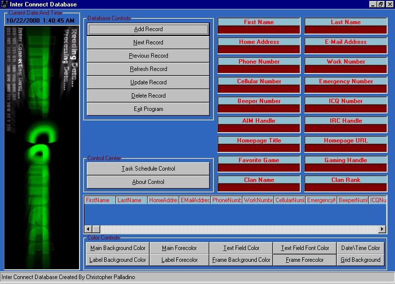



## Inter Connect Database

### Description

DAO based database program with many features in it, I also noticed after

searching around I seen no databases that supported saving gaming info so I

made one witht he ability for saving game info such as favorite game, gaming

handle, clan name, clan rank... Also added the ability to change the color

of almost virtually everything you can see. This is my first database I made

or even attempted so don't expect much from this but I think for a first

attempt this came out da!mn good... I know my error handling lacks a lot and

I think I will be implementing the ability to email from this program,

search may be implemented but I never had a use for a search option in all

databases I used so thats a maybe... Also I plan on adding a user login

feature, I tried to comment on as much as possible this is basically for

those looking to break into databases since I think I successfully created a

pretty good first database.

**Extra Cool features**

Double clicking on the email text box will open up your email application

and fill in the To: field with the contacts email address, double click any

phone area option to call up a form in which you can type in the contacts

number and call them (example taken from the sample that comes with vb6, i

just thought it would make an excellent option... Also your pc must be

connected to the same line as your phone line in order to work) and double

clicking on the Homepage Title or Homepage URL will open your browser and

take you to the contacts homepage...I also included a timer feature so you

can specify any hour or minute you wish and set the alarm then it will

display a message box at the specified time reminding you to complete your

task...
 
### More Info
 

             |
---                |---
**Submitted On**   |2000-10-25 10:30:18
**By**             |[Chris ](https://github.com/Planet-Source-Code/PSCIndex/blob/master/ByAuthor/chris.md)
**Level**          |Intermediate
**User Rating**    |5.0 (15 globes from 3 users)
**Compatibility**  |VB 6\.0
**Category**       |[Databases/ Data Access/ DAO/ ADO](https://github.com/Planet-Source-Code/PSCIndex/blob/master/ByCategory/databases-data-access-dao-ado__1-6.md)
**World**          |[Visual Basic](https://github.com/Planet-Source-Code/PSCIndex/blob/master/ByWorld/visual-basic.md)
**Archive File**   |[CODE\_UPLOAD1097510262000\.zip](https://github.com/Planet-Source-Code/chris-inter-connect-database__1-12315/archive/master.zip)

